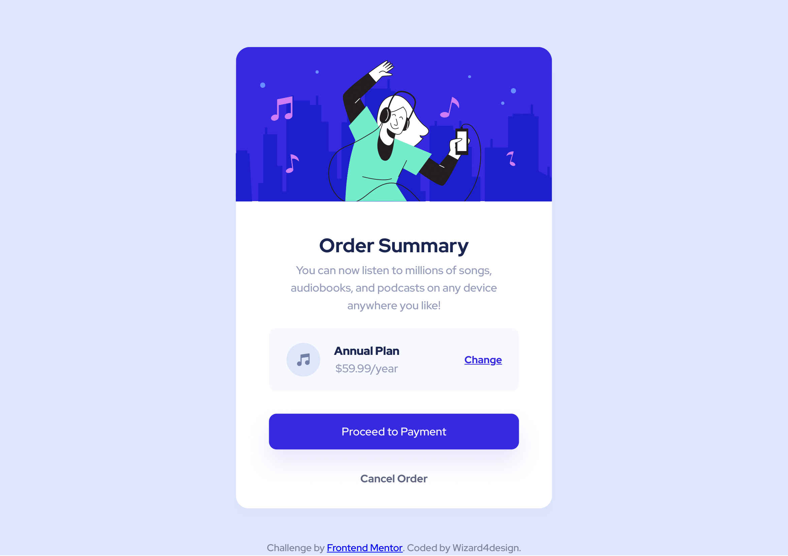

# Frontend Mentor - Order summary card solution

This is a solution to the Order summary card challenge on Frontend Mentor. Frontend Mentor challenges help you improve your coding skills by building realistic projects. 

## Overview

### Screenshot

### Links

- [Solution URL] (https://github.com/Wizard4design/Order-summary-component)
- [Live Site URL] (https://wizard4design.github.io/Order-summary-component)

### Built with

- Semantic HTML5 markup
- CSS3 custom properties
- Flexbox

## Author

- Website - Ivan / Frontend-Wizard
- Frontend Mentor - [@Frontend-Wizard](https://www.frontendmentor.io/profile/Frontend-Wizard)
